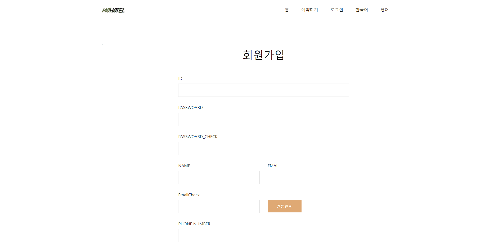
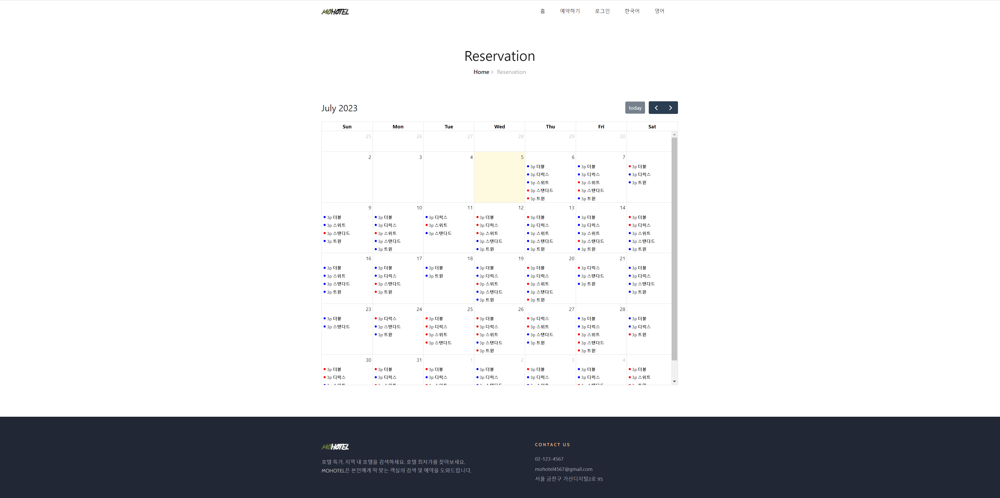
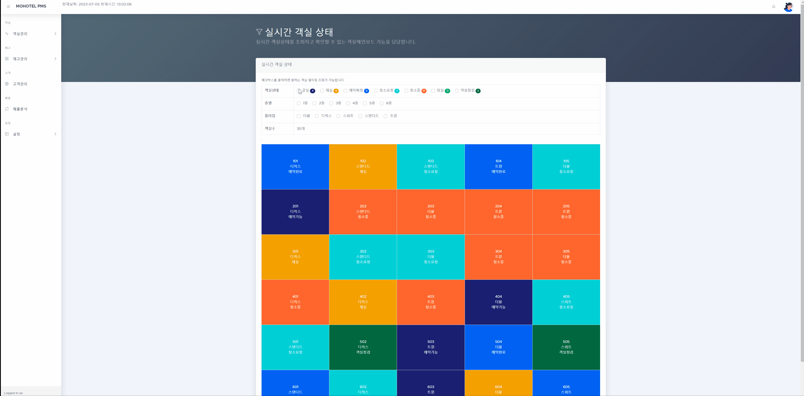
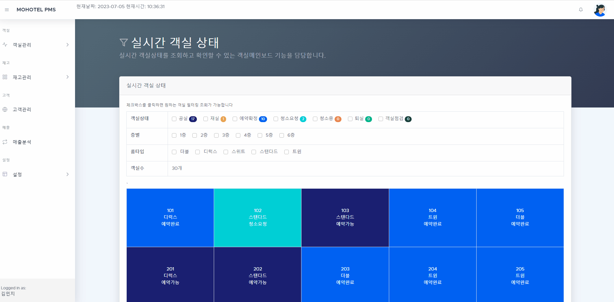
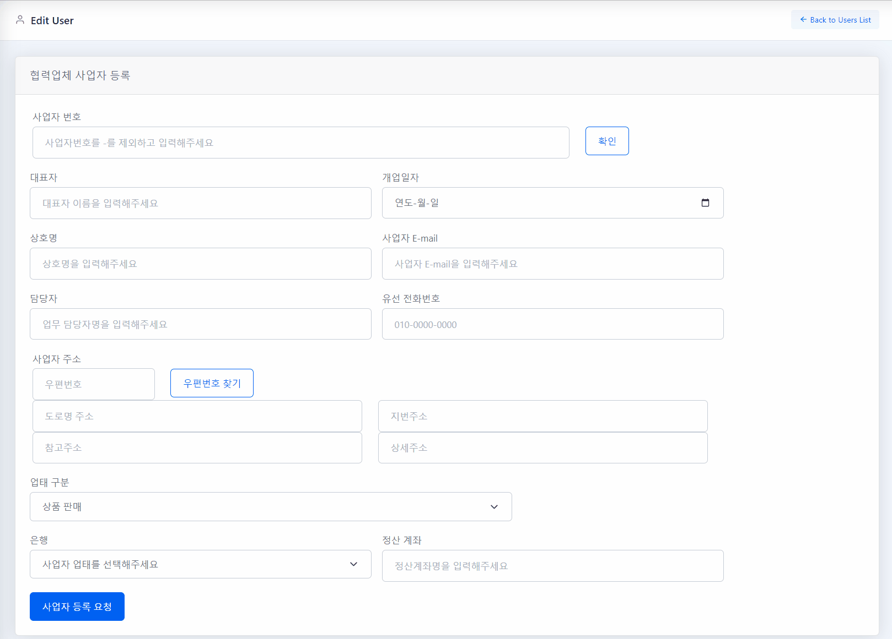
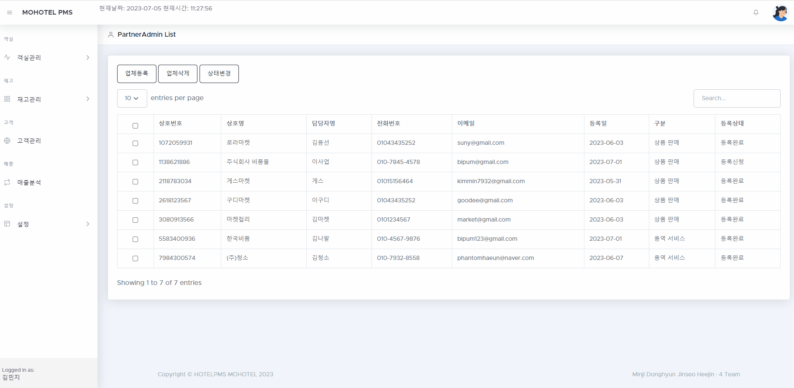
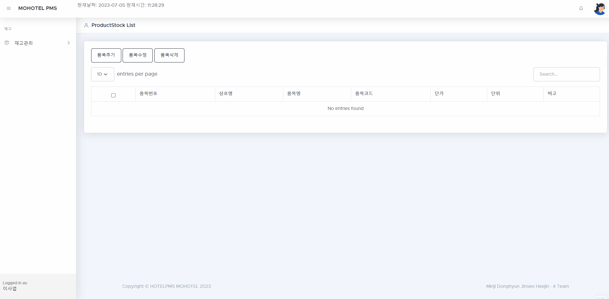
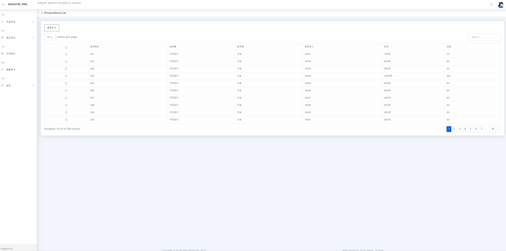
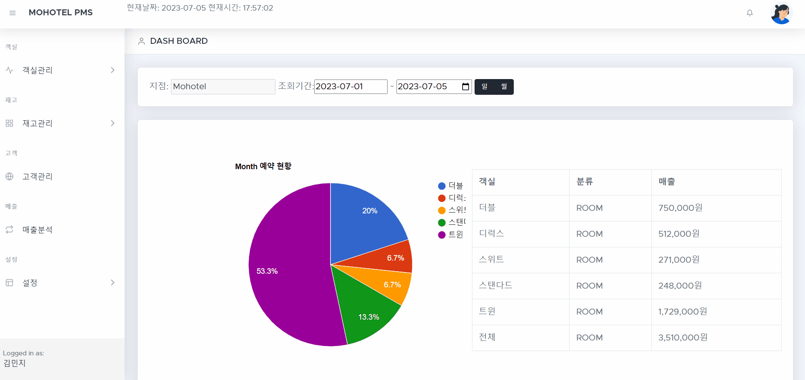

# 🔔 호텔 PMS 
## 📘 목차

- 👩 [팀원](#-팀원소개)
- 📄 [개요](#-개요)
- 🔨 [기술 및 도구](#-기술-및-도구)
- 💻 [기능구현](#-기능구현)
  - [예약 사이트](#1-예약-사이트)
    - 로그인 및 회원가입
    - 마이페이지
    - 예약캘린더
    - 결제 
  - [호텔 PMS](#2-호텔-PMS)
    - 관리자(및 매니저)
    - 상품 판매
    - 용역 서비스
- ⛳️ [배포](#-배포)
- 🚨 [Troubleshooting](#-troubleshooting)

## **👩 팀원소개**
> **팀장:** 김민지
> 
> 예약사이트: 메인페이지, 일반 회원가입, 카카오 소셜 로그인(API), 일반 로그인, 다국어 설정, 전체예약캘린더
> 
> 호텔 PMS  : 메인페이지, 예약확정&재실 모듈, 문자발송 API, 업체별 품목 리스트, 관리자 업체 리스트, 객실 별 소모품 설정,통계(월별 및 객실별 매출통계, 일별 예약된 객실 개수 통계)
>

> **팀원:** 김동현
>
> 

> **팀원:** 김희진
>
> 예약 사이트 :메인페이지, 호텔 예약 페이지(FullCalendar API), 호텔 상세 예약 페이지 (Bootstrap Calendar)
>
> 호텔 PMS : 메인 페이지 (일일 호텔 예약 통계), 업체 등록 페이지(공공데이터 사업자 인증 API / 우편번호 서비스 API), 실시간 객실 예약 페이지 ,전체 품목 리스트,
>            업체별 월별 정산 리스트

> **팀원:** 김진서
> 
> 예약사이트: 결제 및 환불(API), 약관동의, 예약정보 및 결제내역페이지, 예약할인
> 
> 호텔 PMS  : 객실현황(간트차트), 알림(WebSocket), 발주(관리자 -> 업체), 객실 청소상태 보고 및 확인, 재고리스트, 객실설정, 통계(일별              및 객실별 매출통계)
>

## **📄 개요**

   
  
   

> **프로젝트:** 예약 사이트 & 호텔 PMS
>
> **기획 및 제작:** 김민지,김동현,김희진,김진서
>
> **분류:** 팀 프로젝트
>
> **제작 기간:** 2023.05.17 ~ 06.22
>
> **배포일:** 2023
>
> **사용 기술:** SPRING BOOT
>
> **문의:** kimmin7932@gmail.com

## **🔨 기술 및 도구**

|Category|Detail|
|:--:|:--:|
|FrontEnd|HTML5, JS, CSS3, JQuery|
|BackEnd|Java(JDK 1.8), Servlet, Spring, Mybatis|
|OS|Windows 10, MacOS|
|Libray&API|Spring Security, Validation, MailSender, Apache Commons FileUpload, WebSocket, Lombok, Fullcalendar, Kakaomap, KakaoLogin, Apache Poi
|IDE|IntelliJ, VisualStudio, DBeaver|
|Server|Tomcat(v8.5)|
|Document|Google Drive, KakaoOven, ERDCloud, EdrawMind|
|CI|Github|
|DateBase|AWS RDS, Oracle, Docker|
## **💻 기능구현**
### 1. 예약 사이트

  #### 1-1. 다국어
   

  - en 클릭 시 header, body, footer 등 언어가 모두 영어로 변경
  - ko 클릭시 이하 동문 모두 한국어로 변경 
  - 반응형 웹을 고려하여 모바일로 접근 시 네비게이션 메뉴 변경, 동일하게 다국어 지원

  #### 1-2. 회원가입 및 로그인
   

  - 일반 회원가입 후 로그인 기능
  - 구글 이메일 API 사용

  

  - Spring form 유효성 검사 사용
  - 아이디, 이메일, 전화번호 중복 검사, 비밀번호 체크기능 등

  

  - 카카오 소셜 로그인(API) 구현

  #### 1-3. 동현

  #### 1-4. 예약 캘린더
   

  - Full-Calendar API를 사용하여 전체 예약 내역을 확인 가능
  - 예약 일자 이전 예약 내역은 예약 불가능 하도록 숨김 처리
  - 예약 가능 내역은 파란색 예약 불가능 내역은 빨간색으로 표시
  - 객실 타입 클릭시 예약 내역 페이지로 이동

  #### 1-5. 예약
   

  - Bootstrap Calendar 를 사용하여 오늘 날짜(노란색)와 선택 날짜(초록색)를 표시
  - 캘린더 날짜 클릭시 해당 예약 페이지로 이동
  - 예약 불가능한 객실 타입은 선택 불가
  - 기준/최대 인원 초과시 선택 불가
  - 투숙 기간에 따라 결제 요금이 변경 되도록 구현

  

  - PG 결제 연동 API를 사용하여 결제 기능 구현
  - 결제 후 결제 및 예약정보를 확인 할 수 있으며 환불 가능
  - 첫 예약 시 10% 할인 적용
  - 비로그인시 로그인 페이지로 이동하며  약관동의에 체크 완료 시 결제가능

  #### 1-6. 예약리스트
   

  - 예약 상세정보들을 확인 할 수 있으며 환불 가능
  - 예약리스트에 예약중인 객실이 없으면 예약페이지로 이동 링크 생성

### 2. 호텔 PMS 

  #### 2-1. 실시간 객실 현황
   

  - 실시간 객실 상태를 확인 가능
  - 객실 상태, 층별, 룸타입 별 필터링 기능
  - 객실 상태 변경시 실시간으로 반영
  - 예약 완료 내역 클릭시 예약 확정 페이지로 이동

  #### 2-2. 객실현황
   

  - 2,3,4주 단위로 객실현황을 확인 할 수 있음
  - 타입,룸,날짜 별로 객실상태를 확인 할 수 있으며 튤팁을 활용하여 예약정보를 확인 할 수 있음

  #### 2-3. 예약등록, Check In/Out
   

  - 객실상태가 예약완료 또는 재실일 때 프론트 직원이 접근 가능
  - 예약완료인 객실을 눌러 '초기화, 저장, 문자발송, 체크인' 기능 조작
  - 고객의 요청에 따라 인 수 조정과 레이트 체크아웃 가능
  - 고객의 예약 정보에 응하여 문자 전송 (SMS API)
  - 체크인 시 재실로 변경 동시에 비품 차감

   

  - 재실 상태인 객실에서 세 가지는 동일 기능
  - 용역 서비스 업체에 청소요청 가능

  #### 2-4 동현

  #### 2-5. 객실청소상태 보고 및 확인
  

  - 청소담당자는 청소 후 청소상태를 보고 할 수 있으며 관리자는 청소상태를 확인 할 수 있음
  - 객실청소 확인 시 확인여부 변경 (미확인->확인)

  #### 2-6. 사업자 등록
  

  - 호텔 pms 파트너 등록을 위한 사업자 등록 페이지
  - 공공데이터 사업자 인증 API 를 통해 사업자 번호 일치 여부 확인
  - 중복 가입 된 사업자 번호는 가입 불가능 하도록 처리
  - 등록 완료시 관리자 승인 후 pms 사이트 이용 가능

  #### 2-7. 업체 리스트
  

  - 관리자도 사업자 등록이 가능
  - 업체 삭제 가능, 이때 로그인 정보도 삭제
  - 사업자 등록 직후 등록상태가 '등록신청', 관리자가 상태 변경시 '등록완료'로 변경
  - '등록완료' 후 사업자 번호로 로그인 정보 생성

  #### 2-8. 업체별 품목 리스트
  

  - 품목 추가시 '품목명, 분류코드, 단가, 단위, 비고' 작성
  - 분류코드는 자동으로 영대문자+숫자 세자리로 자동 부여
  - 품목 수정 삭제도 가능

  #### 2-9. 전체 품목 리스트
  

  - 전체 사업자가 등록한 모든 품목 리스트를 확인하는 페이지
  - 품목 추가 시 재고리스트에 등록 처리
  - 자동발주수량 설정 시 등록 처리 및 자동 발주

  #### 2-10. 재고리스트
  

  - 재고수량이 자동발주수량이하로 떨어지면 발주상태는 '양호'에서 '재고부족'으로 변경되며
    관리자에게 알림 발송 ( 3번 상품의 재고가 부족합니다.)
  - 자동발주수량 수정가능
    
  #### 2-11. 발주
 

  - 관리자가 '재고부족' 알림 클릭시 재고리스트 페이지로 이동하며 재고부족 상품을 클릭하면 발주상태가 
    '발주요청'으로 바뀌고 해당 업체로 '발주요청' 알림이 발송 
  - 업체가 '발주요청' 알림클릭 시 업체별 재고 관리 리스트로 이동 후 업체는 해당 상품을 발주가능
  /* 동현 세부 설명 추가 */

  #### 2-12. 객실설정
 

  - 객실타입별로 인원 및 가격을 수정 가능

  #### 2-13. 객실별 소모품 설정
  

  - 객실타입별로 비품 설정
  - 비품명, 비품코드로 구분하며 개수 설정이 가능
  - 고객이 체크인 시 설정한 비품이 호텔재고에서 차감

 #### 2-14. 매출분석
 

  - 월별, 일별 객실별 예약 및 매출통계 확인 가능
  - 일별 예약된 객실 개수 그래프
 

## **⛳️ 배포**
## **🚨 Troubleshooting**

- [예약](TroubleShooting/reservation.md)
>- 비로그인 시 예약처리
>- 결제금액 오류
- [예약리스트](TroubleShooting/reservationList.md)
>- 환불 실패
- [객실현황](TroubleShooting/roomStatus.md)
>- 간트차트의 테이블 고장
- [객실청소상태 보고 및 확인](TroubleShooting/roomCleaningStatus.md)
>- 객실청소상태 확인 시 사진파일 로드 X
- [사업자 품목 리스트](TroubleShooting/partnerList.md)
>- 품목코드 SELECT BOX로 자동 부여
>- 업체별 품목 리스트 분류
- [발주](TroubleShooting/order.md)
>- 페이지 'Reload' 시 'WebSocket'으로 구현한 알림이 사라짐
>- 관리자와 업체 알림 구분이 안됨
- [통계](TroubleShooting/statistics.md)
>- 월별 매출 통계 잘못된 추출